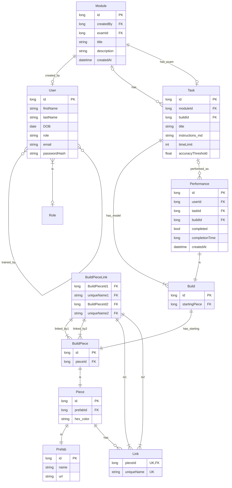

# Application ERD

```mermaid
erDiagram
  User {
    long id PK
    string firstName
    string lastName
    date DOB
    string role
    string email
    string passwordHash
  }
  User }o--o{ User: trained_by
  User }|--o| Role: is

  Module {
    long id PK
    long createdBy FK
    long examId FK
    string title
    string description
    datetime createdAt
  }
  Module ||--o| User: created_by
  Module |o--o{ Task: has
  Module ||--o| Task: has_exam

  Task {
    long id PK
    long moduleId FK
    long buildId FK
    string title
    string instructions_md
    int timeLimit
    float accuracyThreshold
  }
  Task ||--|{ Build: has_model
  Task |o--o{ Performance: performed_as

  Performance {
    long id PK
    long userId FK
    long taskId FK
    long buildId FK
    bool completed
    long completionTime
    datetime createdAt
  }
  Performance ||--|| Build: is

  Build {
    long id PK
    long startingPiece FK
  }
  Build ||--|| BuildPiece: has_starting

  BuildPiece {
    long id PK
    long pieceId FK
  }
  BuildPiece ||--|| Piece: is

  BuildPieceLink {
    long BuildPieceId1 FK
    string uniqueName1 FK
    long BuildPieceId2 FK
    string uniqueName2 FK
  }
  BuildPieceLink ||--|{ BuildPiece: linked_by1
  BuildPieceLink ||--|{ BuildPiece: linked_by2
  BuildPieceLink ||--|{ Link: is1
  BuildPieceLink ||--|{ Link: is2

  Piece {
    long id PK
    long prefabId FK
    string hex_color
  }
  Piece ||--|| Prefab: is
  Piece ||--o{ Link: has

  Link {
    long pieceId UK, FK
    string uniqueName UK
  }

  Prefab {
    long id PK
    string name
    string url
  }
```
