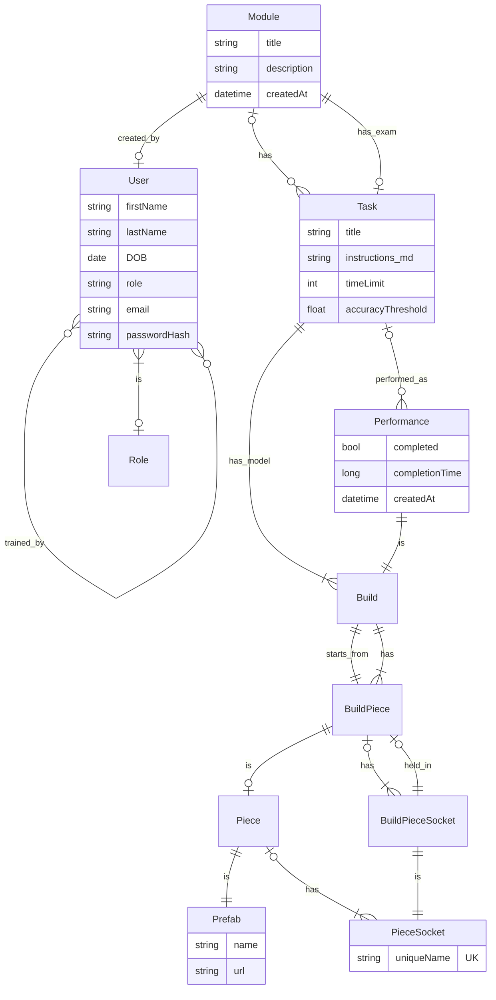

# Application ERD

```mermaid
erDiagram
  User {
    string firstName
    string lastName
    date DOB
    string role
    string email
    string passwordHash
  }
  User }o--o{ User: trained_by
  User }|--o| Role: is

  Module {
    string title
    string description
    datetime createdAt
  }
  Module ||--o| User: created_by
  Module |o--o{ Task: has
  Module ||--o| Task: has_exam

  Task {
    string title
    string instructions_md
    int timeLimit
    float accuracyThreshold
  }
  Task ||--|{ Build: has_model
  Task |o--o{ Performance: performed_as

  Performance {
    bool completed
    long completionTime
    datetime createdAt
  }
  Performance ||--|| Build: is

  Build ||--|| BuildPiece: starts_from
  Build ||--|{ BuildPiece: has

  BuildPiece ||--o| Piece: is
  BuildPiece |o--|{ BuildPieceSocket: has
  BuildPiece |o--|| BuildPieceSocket: held_in

  BuildPieceSocket ||--|| PieceSocket: is

  Piece ||--|| Prefab: is
  Piece |o--|{ PieceSocket: has

  PieceSocket {
    string uniqueName UK
  }

  Prefab {
    string name
    string url
  }
```
